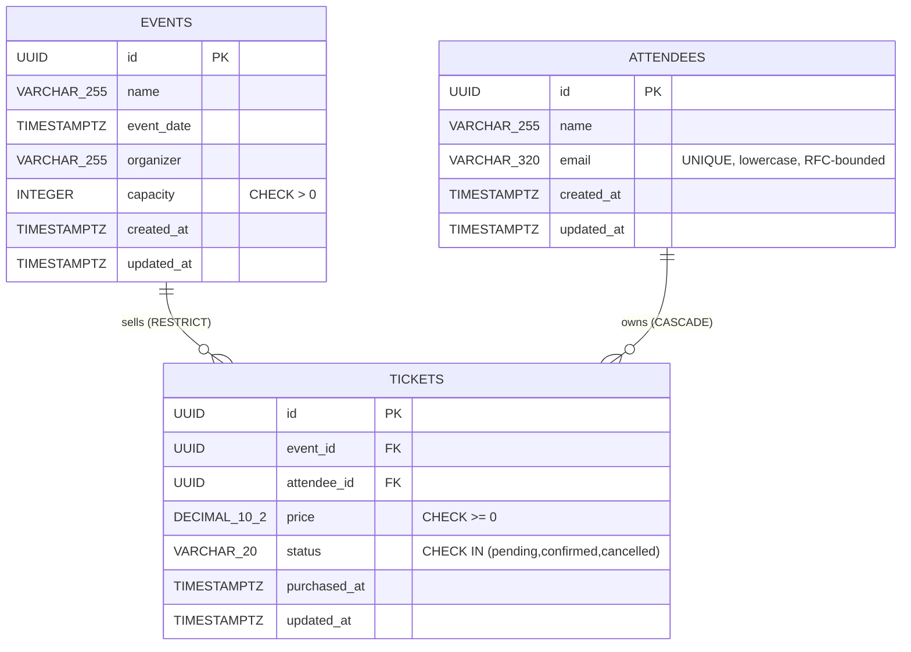

# Event Management System -- Schema Design

PostgreSQL 14+ schema for a normalized (3NF) event-ticketing domain: events, attendees, and the tickets that link them.

## 1. Entity Overview

| Table       | Purpose                                                   | Cardinality vs. parents                  |
|-------------|-----------------------------------------------------------|------------------------------------------|
| `events`    | One row per scheduled event (concert, workshop, etc.).    | Root entity.                             |
| `attendees` | One row per unique person, identified by email.           | Root entity (decoupled from events).     |
| `tickets`   | One row per purchased ticket. Junction-with-attributes.   | N events : N attendees, with payload.    |

## 2. Entity-Relationship Diagram



## 3. Column Reference

### `events`

| Column       | Type          | Constraints                       | Notes                                         |
|--------------|---------------|-----------------------------------|-----------------------------------------------|
| `id`         | UUID          | PK, default `gen_random_uuid()`   | Surrogate, opaque.                            |
| `name`       | VARCHAR(255)  | NOT NULL                          | Display name.                                 |
| `event_date` | TIMESTAMPTZ   | NOT NULL                          | Stored UTC.                                   |
| `organizer`  | VARCHAR(255)  | NOT NULL                          | String for now; see "Future migrations" below.|
| `capacity`   | INTEGER       | NOT NULL, CHECK `capacity > 0`    | Max tickets sellable.                         |
| `created_at` | TIMESTAMPTZ   | NOT NULL, default `NOW()`         | Audit.                                        |
| `updated_at` | TIMESTAMPTZ   | NOT NULL, default `NOW()`, trigger| Maintained by `set_updated_at` trigger.       |

### `attendees`

| Column       | Type          | Constraints                                                       | Notes                                  |
|--------------|---------------|-------------------------------------------------------------------|----------------------------------------|
| `id`         | UUID          | PK, default `gen_random_uuid()`                                   | Surrogate.                             |
| `name`       | VARCHAR(255)  | NOT NULL                                                          | Display name.                          |
| `email`      | VARCHAR(320)  | NOT NULL, UNIQUE, CHECK lowercase, CHECK shape `%_@_%.__%`        | RFC 5321 max length (64+1+255).        |
| `created_at` | TIMESTAMPTZ   | NOT NULL, default `NOW()`                                         |                                        |
| `updated_at` | TIMESTAMPTZ   | NOT NULL, default `NOW()`, trigger                                |                                        |

### `tickets`

| Column         | Type          | Constraints                                                          | Notes                                                |
|----------------|---------------|----------------------------------------------------------------------|------------------------------------------------------|
| `id`           | UUID          | PK                                                                   |                                                      |
| `event_id`     | UUID          | NOT NULL, FK -> `events(id)` ON DELETE RESTRICT                      | Block accidental event deletion with sold tickets.   |
| `attendee_id`  | UUID          | NOT NULL, FK -> `attendees(id)` ON DELETE CASCADE                    | Tickets follow GDPR deletion of the owning person.   |
| `price`        | DECIMAL(10,2) | NOT NULL, CHECK `price >= 0`                                         | Captured at purchase time (denormalized, documented).|
| `status`       | VARCHAR(20)   | NOT NULL, default `'pending'`, CHECK IN (pending, confirmed, cancelled) | VARCHAR + CHECK chosen over ENUM for migrability. |
| `purchased_at` | TIMESTAMPTZ   | NOT NULL, default `NOW()`                                            |                                                      |
| `updated_at`   | TIMESTAMPTZ   | NOT NULL, default `NOW()`, trigger                                   |                                                      |

## 4. Normalization (Why 3NF)

A schema is in 3NF when every non-key column depends on **the key, the whole key, and nothing but the key** (no transitive dependencies).

| Table       | 1NF | 2NF | 3NF | Reasoning                                                                                                       |
|-------------|-----|-----|-----|-----------------------------------------------------------------------------------------------------------------|
| `events`    |  Y  |  Y  |  Y  | Single-column PK, no composite, no transitive deps (organizer is a label, not a derived attribute of capacity). |
| `attendees` |  Y  |  Y  |  Y  | Single-column PK; `email` and `name` are direct attributes of the person.                                       |
| `tickets`   |  Y  |  Y  |  Y  | `price` and `status` belong to the ticket itself, not transitively to event or attendee.                        |

**What we did NOT do (and why):**

- **No `event_name` column on `tickets`**: it would transitively depend on `event_id` -> 2NF violation.
- **No `attendee_email` column on `tickets`**: same reason -- transitive on `attendee_id`.
- **No `tickets_sold` counter on `events`**: derivable as `COUNT(*) FROM tickets WHERE event_id = ? AND status <> 'cancelled'`. Caching it would be denormalization for performance only and would require trigger-based maintenance. We declined unless and until profiling proves it necessary.

**Documented denormalization:**

- `tickets.price` is captured per-ticket rather than referenced from a (hypothetical) event price column. This is intentional: financial/audit requirements demand that the price the attendee actually paid is preserved even if event pricing changes later. This is denormalization for **historical correctness**, not for performance.

## 5. Foreign Key Strategy

| FK                                 | ON DELETE | Rationale                                                                                                              |
|------------------------------------|-----------|------------------------------------------------------------------------------------------------------------------------|
| `tickets.event_id` -> `events.id`  | RESTRICT  | Deleting an event with tickets is almost always a mistake. Force the operator to cancel/refund tickets first.          |
| `tickets.attendee_id` -> `attendees.id` | CASCADE   | A "delete my account" request (GDPR Art. 17 / CCPA) must remove the tickets too -- they identify the person.            |

`ON UPDATE CASCADE` is set on both for completeness, though UUID primary keys are not expected to change.

**Why not SET NULL anywhere?** Both `event_id` and `attendee_id` are `NOT NULL`. An orphaned ticket has no business meaning; allowing nulls would silently destroy referential semantics.

## 6. Index Strategy

See `indexes.sql` for the full DDL. Summary:

| Index                              | Columns                  | Supports query #          | Type / purpose                                  |
|------------------------------------|--------------------------|---------------------------|-------------------------------------------------|
| `events_pkey`                      | `(id)`                   | All PK lookups            | Primary key (automatic).                        |
| `idx_events_event_date`            | `(event_date)`           | Q3 upcoming events        | Range scan + sort elimination.                  |
| `idx_events_organizer`             | `(organizer)`            | Q5 events by organizer    | Equality lookup.                                |
| `attendees_pkey`                   | `(id)`                   | All PK lookups            | Primary key (automatic).                        |
| `attendees_email_unique`           | `(email)`                | Q2 lookup by email        | Unique constraint -> automatic unique index.    |
| `tickets_pkey`                     | `(id)`                   | All PK lookups            | Primary key (automatic).                        |
| `idx_tickets_event_id`             | `(event_id)`             | Q1, FK integrity          | FK index -- avoid sequential scans on parent ops.|
| `idx_tickets_attendee_id`          | `(attendee_id)`          | Q2, cascade DELETE        | FK index -- without this, CASCADE is O(N).      |
| `idx_tickets_status`               | `(status)`               | Global status reports     | Low-selectivity but cheap and useful for ops.   |
| `idx_tickets_event_attendee`       | `(event_id, attendee_id)`| Composite JOIN/dedup      | Left-prefix supports event_id-only filters too. |
| `idx_tickets_event_status`         | `(event_id, status)`     | Q4 per-event status counts| Index-only scan + GroupAggregate.               |

**Trade-off statement:** the tickets table carries 5 indexes (PK + 4 secondary). Each INSERT touches all of them. Event-management workloads are read-heavy by orders of magnitude, so this is the correct trade-off; the first index to drop under write pressure is `idx_tickets_status`.

## 7. Sample Data and Relationship Walkthrough

```sql
-- 1. Two events.
INSERT INTO events (id, name, event_date, organizer, capacity) VALUES
  ('11111111-1111-1111-1111-111111111111', 'PG Day NYC',     '2026-09-12 09:00:00+00', 'Alice Adams', 300),
  ('22222222-2222-2222-2222-222222222222', 'SQL Tuning 101', '2026-10-04 14:00:00+00', 'Alice Adams', 50);

-- 2. Two globally-unique attendees.
INSERT INTO attendees (id, name, email) VALUES
  ('aaaaaaaa-aaaa-aaaa-aaaa-aaaaaaaaaaaa', 'Bob Builder',   'bob@example.com'),
  ('bbbbbbbb-bbbb-bbbb-bbbb-bbbbbbbbbbbb', 'Carol Coder',   'carol@example.com');

-- 3. Bob attends both events; Carol attends one. Same attendee row reused.
INSERT INTO tickets (event_id, attendee_id, price, status) VALUES
  ('11111111-1111-1111-1111-111111111111', 'aaaaaaaa-aaaa-aaaa-aaaa-aaaaaaaaaaaa', 199.00, 'confirmed'),
  ('22222222-2222-2222-2222-222222222222', 'aaaaaaaa-aaaa-aaaa-aaaa-aaaaaaaaaaaa',  79.00, 'pending'),
  ('11111111-1111-1111-1111-111111111111', 'bbbbbbbb-bbbb-bbbb-bbbb-bbbbbbbbbbbb', 199.00, 'confirmed');
```

Visually:

```
events (PG Day NYC) -- ticket(199, confirmed) -- attendees (Bob)
events (PG Day NYC) -- ticket(199, confirmed) -- attendees (Carol)
events (SQL Tuning) -- ticket( 79, pending  ) -- attendees (Bob)
```

Bob is one row in `attendees` but appears on two tickets across two events -- this is what 3NF buys us.

## 8. The Five Required Queries

```sql
-- Q1. All attendees for a specific event.
SELECT a.id, a.name, a.email, t.status, t.price
FROM   attendees a
JOIN   tickets   t ON t.attendee_id = a.id
WHERE  t.event_id = $1
ORDER  BY a.name;
-- Plan: idx_tickets_event_id -> attendees_pkey

-- Q2. All tickets for a user by email.
SELECT t.id, t.event_id, t.status, t.price, t.purchased_at
FROM   attendees a
JOIN   tickets   t ON t.attendee_id = a.id
WHERE  a.email = LOWER($1);
-- Plan: attendees_email_unique -> idx_tickets_attendee_id

-- Q3. List all upcoming events.
SELECT id, name, event_date, organizer, capacity
FROM   events
WHERE  event_date >= NOW()
ORDER  BY event_date ASC;
-- Plan: idx_events_event_date (range scan, ordered)

-- Q4. Ticket count by status for an event.
SELECT status, COUNT(*) AS ticket_count
FROM   tickets
WHERE  event_id = $1
GROUP  BY status;
-- Plan: idx_tickets_event_status (index-only scan, GroupAggregate)

-- Q5. All events organized by a specific person.
SELECT id, name, event_date, capacity
FROM   events
WHERE  organizer = $1
ORDER  BY event_date DESC;
-- Plan: idx_events_organizer
```

## 9. Design Decisions (Documented Trade-offs)

### 9.1 Email uniqueness: global, not per-event

Decision: `attendees.email` is globally unique. Same email cannot exist twice in the table.

Why:

- An email is a person identifier, not an event-attendance fact. Per-event uniqueness would require duplicating attendee rows (one per event) and break 3NF.
- "Same person attending twice" is modeled as **two ticket rows with the same `attendee_id`**, not two attendee rows.
- Account management (password reset, marketing prefs, GDPR deletion) is dramatically simpler when one email = one row.

### 9.2 Delete behavior

- `tickets.event_id`: **RESTRICT**. Prevents accidental event deletion that would silently destroy ticket history.
- `tickets.attendee_id`: **CASCADE**. Required for "delete my account" requests under GDPR/CCPA.

Rejected:

- `SET NULL` -- both FKs are `NOT NULL`; orphans have no semantic meaning.
- `CASCADE` on event -- too dangerous; accidental DROP of a popular event would silently nuke thousands of paid tickets.

### 9.3 Status: VARCHAR + CHECK, not ENUM

Decision: `status VARCHAR(20) CHECK (status IN ('pending','confirmed','cancelled'))`.

Why: adding a new status (e.g. `'refunded'`) is a one-line `ALTER TABLE` of the CHECK constraint. With a PG ENUM, adding values is fine but **renaming or removing** values requires a much heavier migration. VARCHAR + CHECK keeps schema evolution cheap.

### 9.4 Organizer as VARCHAR

Decision: `events.organizer` is a VARCHAR column for now.

Why: the spec does not require organizer auth, profiles, or contact info. Promoting it to a separate `organizers` table is mechanical:

```sql
-- Future migration sketch
CREATE TABLE organizers (
    id    UUID PRIMARY KEY DEFAULT gen_random_uuid(),
    name  VARCHAR(255) NOT NULL,
    email VARCHAR(320) UNIQUE
);
ALTER TABLE events ADD COLUMN organizer_id UUID REFERENCES organizers(id);
-- backfill organizer_id from organizer text, then drop events.organizer.
```

### 9.5 Capacity tracking: count, do not cache

Decision: `events.capacity` stores the **maximum**; tickets sold is derived via `COUNT(*) FROM tickets WHERE event_id = ?`.

Why: a cached `tickets_sold` column requires trigger-based maintenance and a strong consistency model under concurrency. Single-source-of-truth is simpler and correct by construction. If a single event grows past ~100K tickets and the count query becomes a hot spot, the right fix is a materialized view or a counter table -- not a column on `events`.

## 10. Triggers

`set_updated_at()` -- a single PL/pgSQL function attached to all three tables. On every UPDATE it refreshes `updated_at = NOW()`. This is the standard PG idiom and is preferred over application-side timestamps because it survives raw SQL access (psql, admin tools, replication tooling).

## 11. Future Considerations

| Concern                             | Trigger to act                                             | Approach                                                         |
|-------------------------------------|------------------------------------------------------------|------------------------------------------------------------------|
| Capacity enforcement at write time  | Overselling incidents observed in production               | Trigger or partial unique index counting non-cancelled tickets   |
| Soft delete                         | Auditors require N-year retention                          | Add `deleted_at TIMESTAMPTZ` and partial indexes WHERE NULL      |
| Multi-tenancy                       | Schema serves multiple organizations                       | Add `tenant_id` everywhere + composite uniqueness + RLS          |
| Scaling email lookups (millions)    | `attendees_email_unique` becomes hot                       | Already a unique B-tree -- no additional work needed             |
| Reporting/analytics                 | Slow ad-hoc COUNT/GROUP BY on tickets                      | Materialized view refreshed nightly, or ship to OLAP store       |
